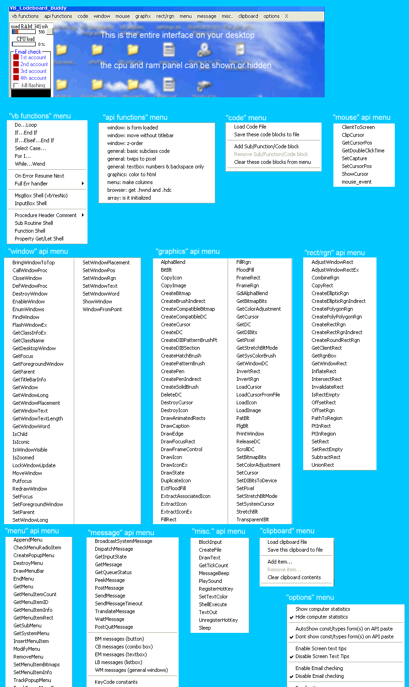



## VB API code assistant  \]\] the ultimate, invisible, visual basic buddy, by your side when U need him\.

### Description

Whether your new to api programming and need that special tutorial "buddy" by your side or your an API pro and just are sick of the hassles of having to find, copy, and paste api declarations and their associated constants and types, then this program is for you. (also included with this download is my "RAM purge" program that allows you to instantly reclaim wasted ram)

This program sits, as a tiny 20 pixel high menu strip on your desktop. You can place it at the very top of your screen or the very bottom, or anywhere in between..its never in the way because it is so small. This program, the VB API code assistant is basically a huge repository of the most commonly used and needed code, just a mouse click away. One click of a button and a procedure header is pasted in your project for you. Another click and the skeleton of an entire select case structure is pasted for you. Want to move a window without a titlebar but forget get how??..one mouse click away. The program also contains well over 100 of the most common api calls along with their constants and type. This program is similair to the well know API-guide..but it takes it to the next level. The screenshot shows all of the menus built into this tiny, thin interface.
 
### More Info
 

             |
---                |---
**Submitted On**   |2005-02-13 16:58:46
**By**             |[Evan Toder](https://github.com/Planet-Source-Code/PSCIndex/blob/master/ByAuthor/evan-toder.md)
**Level**          |Intermediate
**User Rating**    |5.0 (75 globes from 15 users)
**Compatibility**  |VB 3\.0, VB 4\.0 \(16\-bit\), VB 4\.0 \(32\-bit\), VB 5\.0, VB 6\.0
**Category**       |[Complete Applications](https://github.com/Planet-Source-Code/PSCIndex/blob/master/ByCategory/complete-applications__1-27.md)
**World**          |[Visual Basic](https://github.com/Planet-Source-Code/PSCIndex/blob/master/ByWorld/visual-basic.md)
**Archive File**   |[VB\_API\_cod1852392132005\.zip](https://github.com/Planet-Source-Code/evan-toder-vb-api-code-assistant-the-ultimate-invisible-visual-basic-buddy-by-your-side-wh__1-58885/archive/master.zip)

